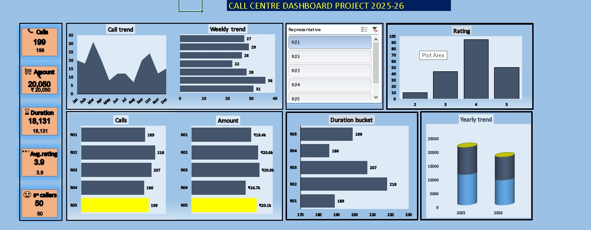

# Call Center Dashboard (Excel)

This project is an interactive Excel dashboard designed to monitor and analyze call center performance. It helps track important KPIs and provides quick insights for better decision-making.

## Features
- Call volume trends
- Average handling time (AHT)
- First call resolution (FCR)
- Agent productivity
- Customer satisfaction
- Interactive filters and slicers

## Preview

## How to Use
1. Download the Excel file from this repository.  
2. Open it in Microsoft Excel 2016 or later.  
3. Use the slicers and filters to interact with the data and view key metrics.

## Tools Used
- Microsoft Excel (PivotTables, Charts, Conditional Formatting, Slicers)

## License
This project is licensed under the MIT License.
